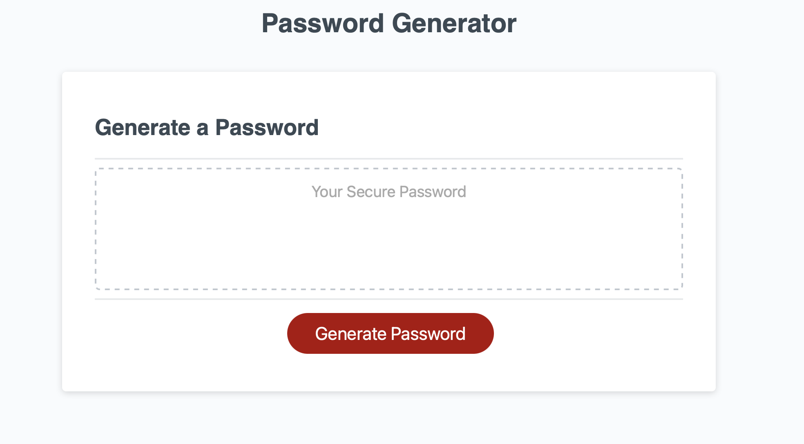

# pw-generator-challenge

Welcome to my Password Generator! 

## What this application does

This application creates a secure password 8-128 characters in length , and a combination of randimized uppercase, lowercase, numbers, and special characters. 

## Technologies I used

Creating this project in Javascript allowed me to assign functions and variables to prompt the user on what they want their password to look like. Once I received their input I was able to assign certain parameters to create a password to the users liking.

## Challenges I faced

I had a challenge with setting the variables of ( maxlength and minlength) to create a scenario where if the user chooses a password length below the minimum of 8 characters, I would automatically give them 8 characters. 

I found the solution by creating an "if" statement that would pass the choice back through the password length. 

## Github Repository
Here is the link to my [Github Repo] (https://github.com/AlySnyder/pw-generator-challenge)

## Github pages link for deployment
Here is the link to my url on [Github pages] (https://alysnyder.github.io/pw-generator-challenge/)

# Picture of the front page

